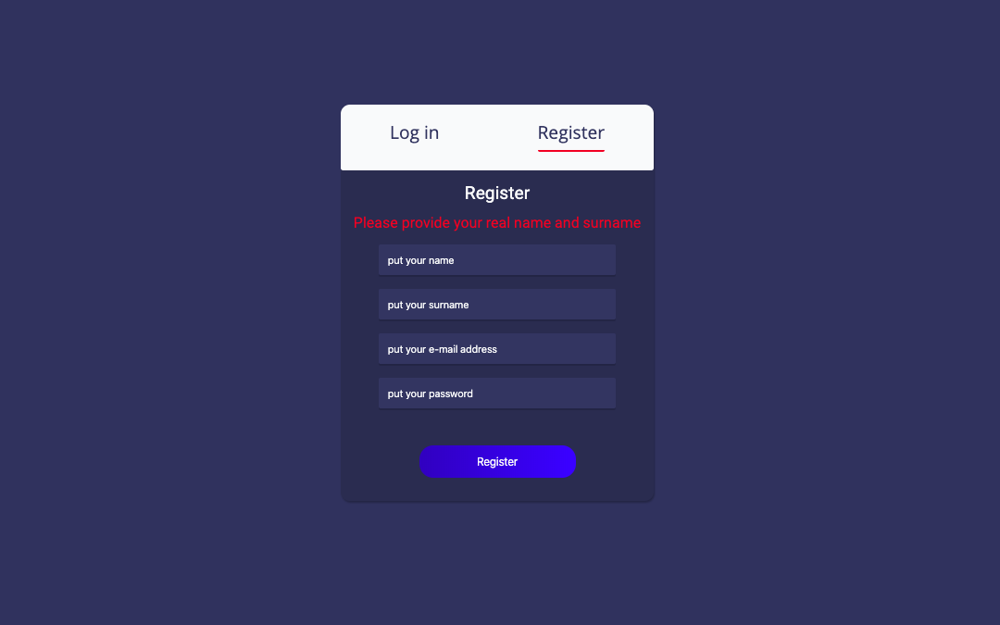
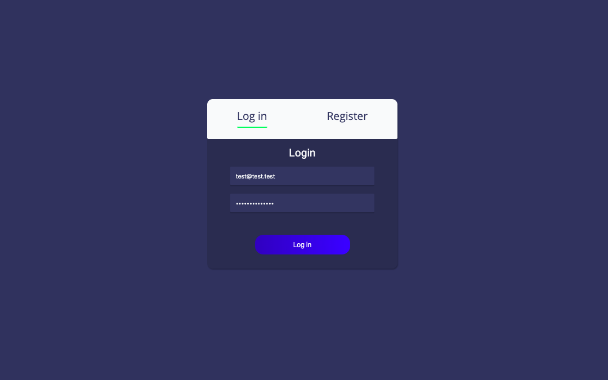
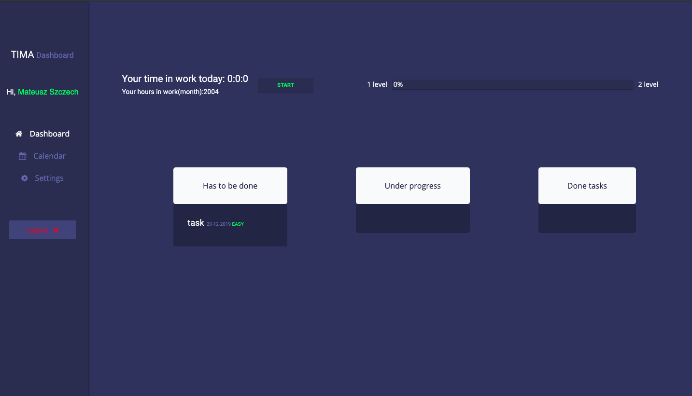
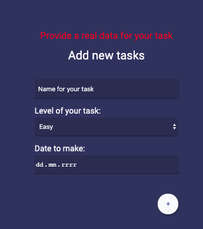
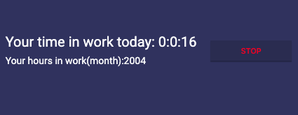
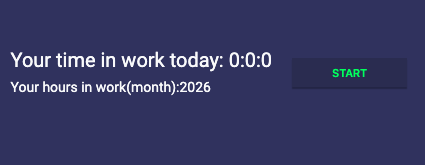
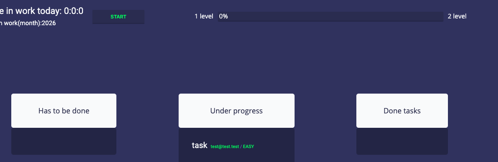
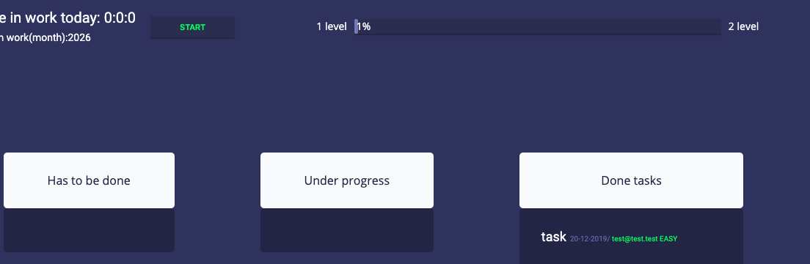

# Tima
<b>##Quick-introduction##</b> 
In my project you can control time in your job. Also you can add tasks, make them and proving yourself by getting level's up if you done it.
 
<b>##What i used</b>  
-React 
-Firebase/firestore 
-SCSS 
-Webpack 
<b>##Pictures:## 

I used react and firestore to make login/register system.There is also validation system. 
<h2>##DASHBOARD</h2>

This is simple dashboard of my project. 
You can add tasks with any users can see it. Any task have his own level which gives more to progress bar

<h2>Timer:</h2>
 
You can start your own timer(how long are you working/day) and you can see monthly work.
If you stop it that time update to monthly time.(for a test i change from hours to seconds preview.)

<h3>Update progress and todo:</h3>
Also there is a todo list and progress bar. They are connected to each other. Thats mean if u done task of any level(easy - 1%, medium - 2%, hard - 3%) it will update your progress bar. If you reach in progress bar 100% you gonna get a next level.
  TODO
 
In todo there is a sort. And it will show you only data with <= currentdate. If is > than current date. It will be avaiable to see when the current date === date what we select.

